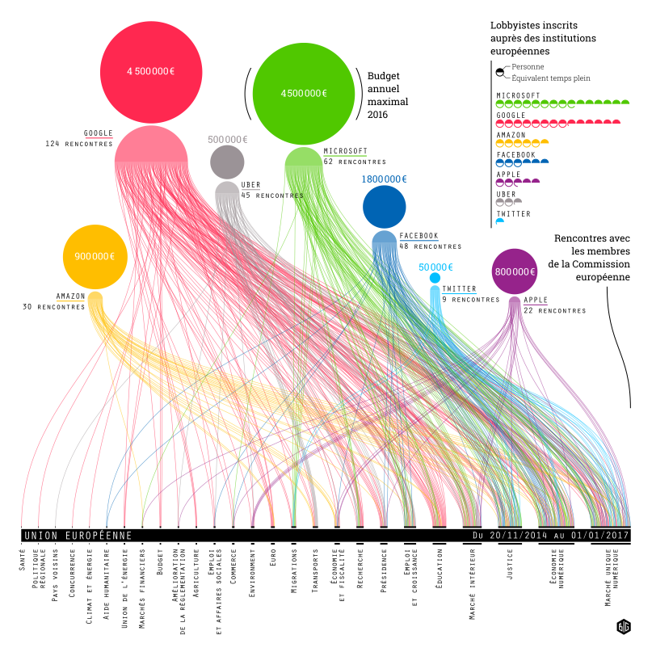

# L'influence tentaculaire des géants américains

## De nombreuses rencontres en Europe

Protection des données personnelles, réglementation des VTC, scénarios fiscaux : les législations européennes et françaises peuvent avoir des effets importants sur les géants technologiques américains et leurs profits. Pour s'éviter des déconvenues budgétaires ou préparer la législation à leurs prochaines innovations, ces géants investissent dans le lobbying. Près de 13 millions d'euros [sont dépensés en lobbying par Google, Microsoft, Facebok, Apple, Amazon, Twitter et Uber](./lobbies.csv).

## Un manque de transparence en France

Les lois concernant le lobbying sont quasiment inexistantes en France. Personne ne répertorie les rencontres entre ceux qui écrivent les lois et les lobbyistes. Parcellairement, on peut reconstituer [quelques rencontres entre le pouvoir exécutif et les géants américains](./rencontres-france.csv). Les rencontres les plus médiatisés sont celles qui donnent une conclusion souriante à des heures de lobbying : la signature d'un contrat entre le ministère de l'Éducation nationale et Microsoft en 2015 ou l'accord entre Google et la presse française, signé en grande pompe à l'Élysée en février 2013.

#### Portes tambour

Ce lobbying discret peut compter sur l'appui de certains serviteurs de l'État [partis travailler pour Uber, Google ou Twitter](./parcours.csv) : c'est ce qu'on appelle les portes tambour. Nous avons analysé le parcours – principalement grâce à LinkedIn, propriété de Microsoft – d'une vingtaine de personnes passées du public à ces entreprises. Ainsi, en 2015, Uber a recruté l'ancien conseiller en communication du secrétaire d'État aux transports, quand Facebook peut compter sur un ancien conseiller de Nicolas Sarkozy à l'Élysée. Ces transferts [ne sont presque pas encadrés](http://www.liberation.fr/france/2016/10/19/les-transferts-de-membres-de-cabinets-ministeriels-ou-presidentiels-peu-transparents_1522984) et quasiment toujours acceptés.

### Les liens de Microsoft

Depuis 2012, Microsoft a signé plusieurs des contrats et conventions. 
* [Une convention a été signée avec le ministère du Logement en janvier 2014](http://etudiant.aujourdhui.fr/etudiant/info/youthspark-le-plan-de-microsoft-pour-aider-300-000-jeunes-et-les-former-vers-le-numerique.html). Accord signé à l'époque avec Constance Parodi, responsable de la «politique de citoyenneté» chez Microsoft, qui est désormais conseillère de la maire de Paris.
* [En novembre 2015, c'est le ministère de l'Éducation nationale qui signait un partenariat avec Microsoft](http://www.education.gouv.fr/cid96030/numerique-a-l-ecole-partenariat-entre-le-ministere-de-l-education-nationale-et-microsoft.html). Le partenariat incite les enseignants et écoliers à utiliser les logiciels de Microsoft. Il a été contesté par des associations libristes, [mais elles ont été déboutées](https://www.nextinpact.com/news/101392-rejet-recours-contre-partenariat-entre-microsoft-et-ministere-education-nationale.htm). 

### Le manque de transparence

Concernant les rencontres avec les dirigeants et les lobbyistes, Axelle Lemaire, secrétaire d'État au numérique, [publiait jusqu'à la moitié de l'année 2016 son agenda en ligne](https://openagenda.com/axelle-lemaire). Cette bonne habitude, qui permettait de facilement suivre son travail s'est hélas arrêtée. Il a fallu éplucher de nombreux pdf d'agenda, pas forcément tous conservés, pour retrouver l'agenda de chaque ministre depuis le début du quinquennat. Quant aux parlementaires, rien ne permet de suivre leurs rendez-vous. La loi Sapin 2, relative à la transparence et à la lutte contre la corruption, votée à l'été 2016 [ne prévoit qu'un registre des lobbyistes](http://www.la-croix.com/Economie/France/La-Sapin-2-rabotee-Conseil-constitutionnel-2016-12-09-1200809313).

**Textes et recherche** : Alexandre Léchenet
**Infographie** : [BiG](http://big.paris)

## Retrouvez l'ensemble des données pour cette enquête
1. [État des lieux des lobbyistes des géants américains](./lobbies.csv)
2. [Rencontres entre les commissaires européens, leurs cabinets et les lobbyistes](./rencontres-europe.csv)
3. [Rencontres (parcellaires) entre le gouvernement français et les lobbyistes](./rencontres-france.csv)
4. [Portes tambour entre l'État et les géants américains](./parcours.csv)